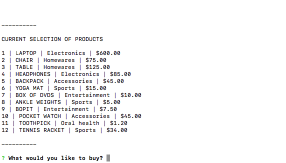

# Bamazon

##### A CLI node.js app that replicates (in a slightly more limited fashion) the eCommerce capabilities of Amazon.

## bamazonCustomer.js

First, the current selection of products is displayed and the user is asked what kind of product they would like to buy.

The user then fills in the inquirer inputs for the product they'd like to buy and the amount. If the product is located in the database, and the amount they'd like to buy is lower than the current stock in the database -- a message appears notifying the purchase and total price.

The user is then asked if they'd like to order something else.

If the user confirms this prompt, they are asked what kind of product they'd like to buy and how much of it again.

If the user requests an amount of product that is greater than the relevant stock in the database, the user is notified of this, shown the amount that *is* in stock, and asked if they'd like to order something else.

When the decides that their spree is over (by not confirming the *order something else* prompt), they receive a simple goodbye message and leave the app.

#### Error handling

If the user requests a product that doesn't match anything in the database, an error message is displayed and the user is asked if they'd like to order something else.

If the user requests a quantity of product that isn't a number, an error message is displayed and they are asked if they would like to order something else.

## bamazonManager.js

The manager (Mr Manager in this case - an Arrested Development reference, not a comment on which gender a manager is likely to or should be) is first presented with a choice of actions.

#### View products for sale

This presents the current inventory, along with stock quantities (differing from bamazonCustomer in this sense). The manager then confirms if there's anything else they'd like to do.

#### View low inventory

Here the products in the database with a low stock quantity (defined as the relatively arbitrary < 50) are displayed. The manager is then asked to confirm if there's anything else they'd like to do

#### Add to inventory

If a manager needs to make an addition to the stock quantity of an already existing product, this functional allows them to do so. They are prompted for which product they are adding to in the form of a list.

Then they're asked how much they are adding. A confirmation message appears once the database has been updated. Finally, the manager is asked to confirm if there's anything else they'd like to do.

#### Add new product(s)

A product addition can be made by choosing this option. The manager is prompted for the product, department, stock, and price of the product. Once the database has been updated, a confirmation message appears and the manager is asked to confirm if there's anything else they'd like to do.

Once the manager has completed all of their managerial tasks, they can choose not to confirm the *anything else to do* prompt and are saluted with a cordial goodbye message.

